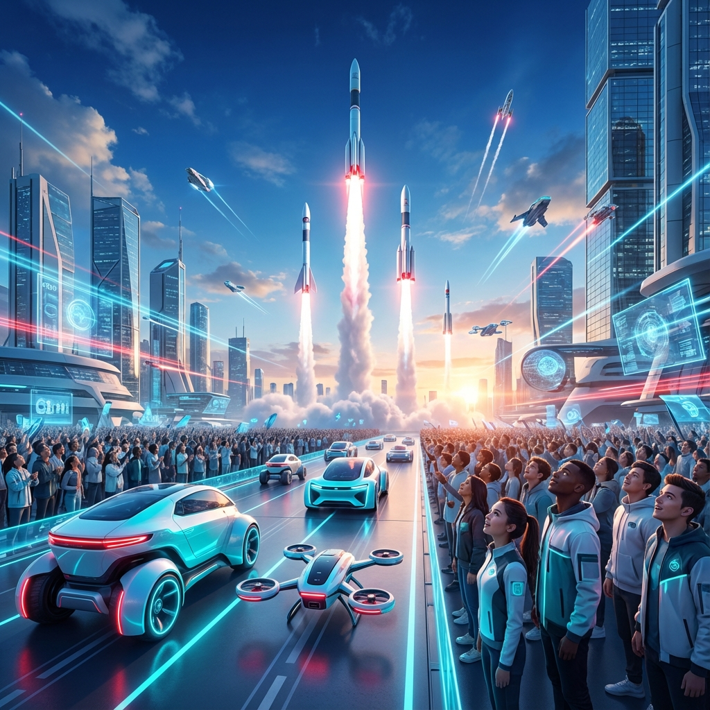
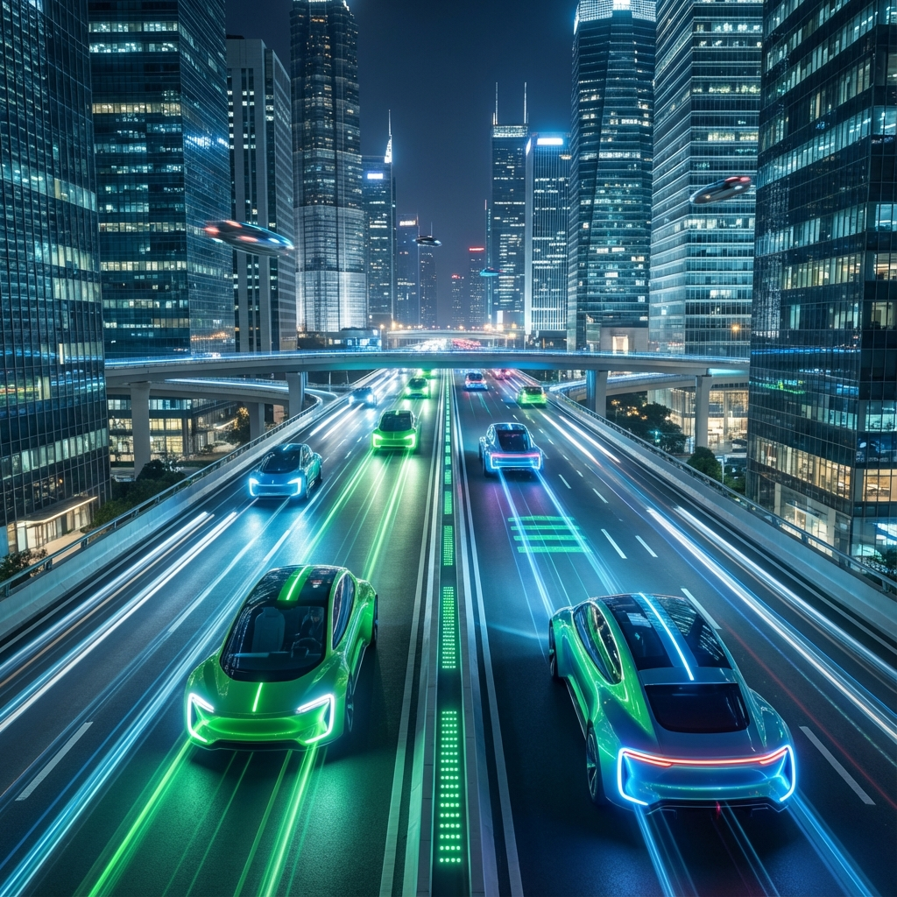

# 🚀 KÜRESEL TEKNOLOJİ LİDERLİĞİNİN YENİ MERKEZİ

 

> **"Bugün tasarladığımız gelecek, yarın dünyanın standardı olacak."**

Hoş geldiniz. Burası, Türkiye'nin sadece teknolojiyi tüketen değil, küresel ölçekte **oyun kurucu** olduğu yeni bir çağın dijital karargahıdır. TEKNOFEST, niceliksel büyüklüğüyle dünyanın bir numarası olduğu gibi, niteliksel çıktalarıyla da teknoloji tarihinin akışını değiştiren bir paradigma devrimidir. Bu repository, bu devrimin mimarları olan sizler için hazırlanmış stratejik bir bilgi üssüdür.

[Yarışmaları Keşfet](#teknoloji-arenasi) • [Rehberler](#yarismaci-kutuphanesi) • [Katkı Ver](#bir-tas-da-sen-koy)

---

## 🌌 VİZYON: KÜRESEL LİDERLİK

Tarihsel bir kırılma anına tanıklık ediyoruz. Savunma sanayiinde yakalanan tartışmasız başarı, sivil teknolojilerin her alanına sirayet ederek Türkiye'yi **"High-Tech"** üretiminin ve inovasyonun küresel başkenti yapma yolunda ilerliyor.

TEKNOFEST; bir festivalden çok daha fazlası;
Bir milletin "Yapamazsınız" diyenlere inat, gökyüzüne, uzaya ve dijital dünyaya vurduğu mührün adıdır. Buradaki her bir satır kod, ülkemizi **Dünyanın 1 Numarası** yapacak olan o büyük ekosistemin bir parçasıdır. Bizler, teknolojiyi sadece kullanan değil, ona yön veren, standartlarını belirleyen ve insanlığın hizmetine en ileri formda sunan bir neslin temsilcileriyiz.

Burada bulacaklarınız basit kodlar değil, geleceğin süper gücünün yapı taşlarıdır:
*   🚀 **Dominasyon:** Kendi roketini, uçağını, işletim sistemini yapan bir iradenin teknik altyapısı.
*   🧠 **Egemenlik:** Veri sömürgeciliğine karşı, yerli ve milli yapay zeka çözümleri.
*   ⚡ **Öncülük:** Dünyayı peşinden sürükleyecek otonom sistemler ve enerji teknolojileri.

---

## ⚔️ TEKNOLOJİ ARENASI

Yarışma kategorilerini keşfedin ve kendi cephenizi seçin.

### 🦅 HAVACILIK VE UZAY

> *İstikbal Göklerdedir.*

| Kategori | Açıklama |
| :--- | :--- |
| **🚀 [Roket](DOMINION_AEROSPACE/roket/)** | Yüksek irtifa roket tasarımı ve simülasyonları. |
| **🛬 [Dikey İnişli Roket](DOMINION_AEROSPACE/dikey_inişli_roket/)** | SpaceX tarzı kontrollü iniş sistemleri. |
| **🛸 [Savaşan İHA](DOMINION_AEROSPACE/savasan_iha/)** | Hava-hava muharebesi yapan otonom İHA'lar. |
| **🚁 [Helikopter Tasarım](DOMINION_AEROSPACE/helikopter_tasarımı/)** | İleri seviye döner kanat tasarımları. |
| **🛰️ [Model Uydu](DOMINION_AEROSPACE/model_uydu/)** | Telemetri ve iletişim sistemleri minyatürize edildi. |
| **✈️ [Uluslararası İHA](DOMINION_AEROSPACE/uluslararası_iha/)** | Sabit ve döner kanatlı İHA görevleri. |
| **🔥 [Jet Motor](DOMINION_AEROSPACE/jet_motor_tasarımı/)** | Gaz türbinli motor teknolojileri. |
| **🐝 [Sürü İHA](DOMINION_AEROSPACE/sürü_iha/)** | Koordineli uçan sürü zekası. |
| **🌊 [Su Altı Roket](DOMINION_AEROSPACE/su_altı_roket/)** | Denizden fırlatılan taktik sistemler. |
| **💡 [Aviation Ideathon](DOMINION_AEROSPACE/aviation_ıdeathon/)** | Havacılık endüstrisi için fikir maratonu. |
| **🏎️ [Drone Yarışması](DOMINION_AEROSPACE/drone_yarısması/)** | Hız ve manevra kabiliyeti. |
| **🌍 [World Drone Cup](DOMINION_AEROSPACE/world_drone_cup/)** | Dünyanın en iyi drone pilotları. |
| **🔒 [Güvenli Uydu Haberleşme](DOMINION_AEROSPACE/güvenli_uydu_haberlesme/)** | Anti-jamming ve şifreli iletişim. |
| **🛡️ [Hava Savunma](DOMINION_AEROSPACE/hava_savunma/)** | Alçak irtifa hava savunma sistemleri. |

---

### 🧠 YAPAY ZEKA VE YAZILIM

> *Veriye Hükmeden, Geleceğe Hükmeder.*

| Kategori | Açıklama |
| :--- | :--- |
| **🇹🇷 [Türkçe NLP](DOMINION_AI_DATA/turkce_dogal_dil_isleme/)** | Doğal Dil İşleme için yerli modeller. |
| **🤖 [Eylem Temelli LLM](DOMINION_AI_DATA/eylem_temelli_türce_llm/)** | Aksiyon alabilen büyük dil modelleri. |
| **🎬 [Yapay Zeka Film](DOMINION_AI_DATA/yapay_zeka_film/)** | Generative AI ile sinematik üretim. |
| **🏥 [Sağlıkta Yapay Zeka](DOMINION_AI_DATA/saglıkta_ai/)** | Medikal görüntüleme ve teşhis sistemleri. |
| **⛓️ [Blokzincir](DOMINION_AI_DATA/blokzincir/)** | Merkeziyetsiz finans ve kimlik çözümleri. |
| **💰 [Finansal Teknolojiler](DOMINION_AI_DATA/finansal_teknolojiler/)** | Fintech ve ödeme sistemleri. |
| **🐛 [Pardus Hata Yakalama](DOMINION_AI_DATA/pardus_hata_yakalama/)** | Açık kaynak işletim sistemi geliştirmeleri. |
| **📍 [Adres Çözümleme](DOMINION_AI_DATA/adres_cozumleme/)** | Coğrafi bilgi sistemleri ve adresleme. |
| **✈️ [Havacılıkta AI](DOMINION_AI_DATA/havacılıkta_ai/)** | Hava araçları için yapay zeka çözümleri. |
| **📶 [Kablosuz Haberleşme](DOMINION_AI_DATA/kablosuz_haberlesme/)** | Yeni nesil haberleşme protokolleri. |
| **💾 [Çip Tasarımı](DOMINION_AI_DATA/çip_tasarımı/)** | IC tasarım ve doğrulama süreçleri. |
| **🏭 [Sanayide Dijital Teknolojiler](DOMINION_AI_DATA/sanayide_dijital_teknolojiler/)** | Endüstri 4.0 ve fabrika otomasyonu. |
| **🧬 [Biyoteknoloji İnovasyon](DOMINION_AI_DATA/biyoteknoloji_inovasyon/)** | Genetik, sentetik biyoloji ve medikal inovasyon. |
| **🎗️ [Onkolojide 3T](DOMINION_AI_DATA/onkolojide_3t/)** | Tanı, Tedavi ve Takip teknolojileri. |
| **🧠 [Psikolojide Uygulamalar](DOMINION_AI_DATA/psikolojide_uygulamalar/)** | Ruh sağlığı için teknolojik çözümler. |
| **🛒 [E-Ticaret Hackathonu](DOMINION_AI_DATA/e_ticaret_hackathonu/)** | Yeni nesil alışveriş deneyimleri. |
| **📱 [NSosyal Creathon](DOMINION_AI_DATA/nsosyal_creathon/)** | Sosyal medya ve içerik üretimi inovasyonu. |
| **⚽ [Robolig](DOMINION_AI_DATA/robolig/)** | Robot futbol ve spor teknolojileri. |
| **⚛️ [Kuantum Teknolojileri](DOMINION_AI_DATA/kuantum_teknolojileri/)** | Kuantum simülasyon ve hesaplama. |

---

### 🚗 OTONOM VE ULAŞIM

> *Yolların Efendisi Yazılımlar.*

| Kategori | Açıklama |
| :--- | :--- |
| **🚕 [Robotaksi](DOMINION_AUTONOMY/robotaksi/)** | Tam otonom binek araç yarışması. |
| **🚙 [İnsansız Kara Aracı](DOMINION_AUTONOMY/insansız_kara_aracı/)** | Zorlu arazi şartlarında otonom navigasyon. |
| **🌊 [İnsansız Su Altı](DOMINION_AUTONOMY/insansız_su_altı/)** | Su altı görüntü işleme ve manipülasyon. |
| **⚓ [İnsansız Deniz Aracı](DOMINION_AUTONOMY/insansız_deniz_aracı/)** | Otonom gemi ve tekne sistemleri. |
| **🚅 [Hyperloop](DOMINION_AUTONOMY/hyperloop/)** | Ses hızında kapsül taşımacılığı. |
| **⚡ [Efficiency Challenge](DOMINION_AUTONOMY/uluslararası_efficiency_elektirikli_arac/)** | Elektrikli araç verimlilik yarışları. |
| **📡 [5G Konumlandırma](DOMINION_AUTONOMY/5g_konumlandırma/)** | Yeni nesil haberleşme ve lokalizasyon. |
| **🚦 [Akıllı Ulaşım](DOMINION_AUTONOMY/akıllı_ulaşım/)** | Trafik yönetimi ve ulaşım zekası. |
| **♻️ [Çevre ve Enerji](DOMINION_AUTONOMY/çevre_enerji/)** | Yenilenebilir enerji ve atık yönetimi. |
| **🏙️ [Geleceğin Şehirleri](DOMINION_AUTONOMY/geleceğin_sürdürülebir_şehirleri/)** | Sürdürülebilir şehircilik ve IoT. |
| **☢️ [Nükleer Enerji](DOMINION_AUTONOMY/nükleer_enerji_teknolojileri/)** | Güvenli nükleer teknolojiler. |
| **🚜 [Tarım Teknolojileri](DOMINION_AUTONOMY/tarım_teknolojileri/)** | Akıllı tarım ve hassas hasat. |

---

### 🌟 TOPLUMSAL DÖNÜŞÜM TEKNOLOJİLERİ

> *İnsanlık İçin Teknoloji.*

| Kategori | Açıklama |
| :--- | :--- |
| **♿ [Engelsiz Yaşam](DOMINION_SOCIETY/engelsiz_yaşam/)** | Engelliler için teknolojik çözümler. |
| **🎓 [Eğitim Teknolojileri](DOMINION_SOCIETY/eğitim_teknolojileri/)** | Öğrenme deneyimini geliştiren araçlar. |
| **🤝 [İnsanlık Yararına Teknoloji](DOMINION_SOCIETY/insanlık_yararına_teknoloji/)** | Afet yönetimi ve sosyal inovasyon. |
| **🌊 [Mavi Vatan Makale](DOMINION_SOCIETY/mavi_vatan_makale/)** | Denizcilik stratejileri üzerine akademik çalışmalar. |
| **🛠️ [Mesleki Yetenek](DOMINION_SOCIETY/mesleki_yetenek/)** | Teknik beceri ve zanaat yarışmaları. |
| **🏛️ [Mimari Görsel Tasarım](DOMINION_SOCIETY/mimari_görsel_tasarım/)** | Geleceğin mimari estetiği. |

### 🏰 İLERİ MİMARİLER (AR-GE MERKEZLERİ)

Yarışmaların ötesinde, teknolojinin kalbinin attığı 3 ana merkez.

| Merkez | Misyon |
| :--- | :--- |
| **🧠 [`_TEKNOFEST_CORE`](_TEKNOFEST_CORE/)** | **Ortak Zeka:** Bütün projelerin kullandığı yapay zeka ve matematik kütüphaneleri. |
| **🧪 [`_FUTURE_LABS`](_FUTURE_LABS/)** | **Gelecek Laboratuvarı:** Kuantum, Nöro-Tech ve Füzyon gibi henüz yarışması olmayan teknolojiler. |
| **🌐 [`_DIGITAL_TWIN`](_DIGITAL_TWIN/)** | **Simülasyon Merkezi:** Araçların dijital ikizleri ve sanal test ortamları. |

---

## 📚 YARIŞMACI KÜTÜPHANESİ

Başarıya giden yolda ihtiyacınız olan teknik cephane.

*   **[Sık Sorulan Sorular (FAQ)](FAQ.md):** Aklınızdaki soruların cevapları.
*   **[Kaynaklar (RESOURCES)](RESOURCES.md):** Eğitim videoları, makaleler ve araçlar.
*   **[Kod Örnekleri (CODE)](_TEKNOFEST_CORE/shared_code/README.md):** Python, C++, MATLAB ve daha fazlası için hazır şablonlar.
*   **[Yol Haritası (ROADMAP)](ROADMAP.md):** TEKNOFEST 2025 ve sonrası için vizyonumuz.
*   **[Şablonlar (TEMPLATES)](_TEKNOFEST_CORE/templates/README_TEMPLATE.md):** Profesyonel dokümantasyon şablonları.

> 🛠️ **İPUCU:** Her klasörün içinde o yarışmaya özel `README.md` dosyalarını mutlaka inceleyin. Orada altın değerinde teknik detaylar saklı.

---

## 🤝 BİR TAŞ DA SEN KOY

Bu repository, kolektif bilincin ürünüdür. Eksik bir şey mi gördün? Daha iyi bir kod mu yazdın?

1.  Bu projeyi **Fork** et.
2.  Bilgini **Commit** et.
3.  Bir **Pull Request** gönder.

> *"En hayırlı insan, insanlara faydalı olandır."* - Bilginin zekatı paylaşmaktır.

---

**TEKNOFEST YARIŞMALARI REPOSITORY**
*Milli Teknoloji Hamlesi'nin Dijital Kütüphanesi*

---

